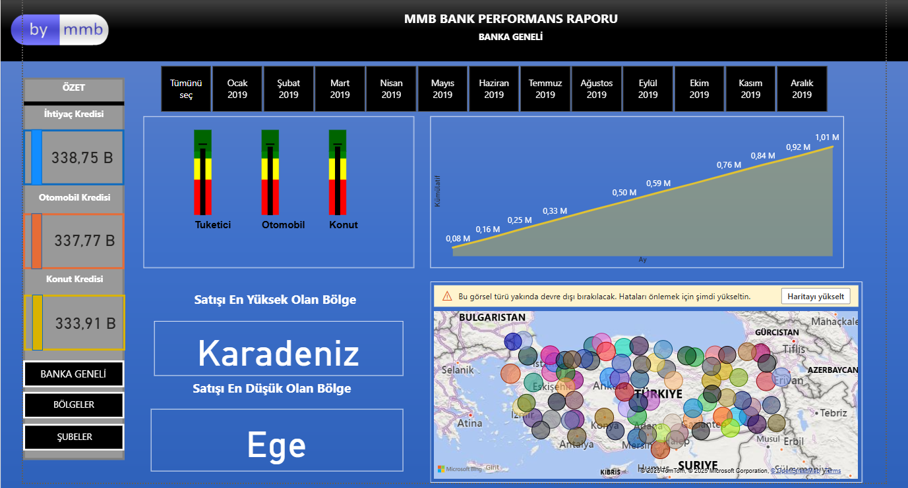
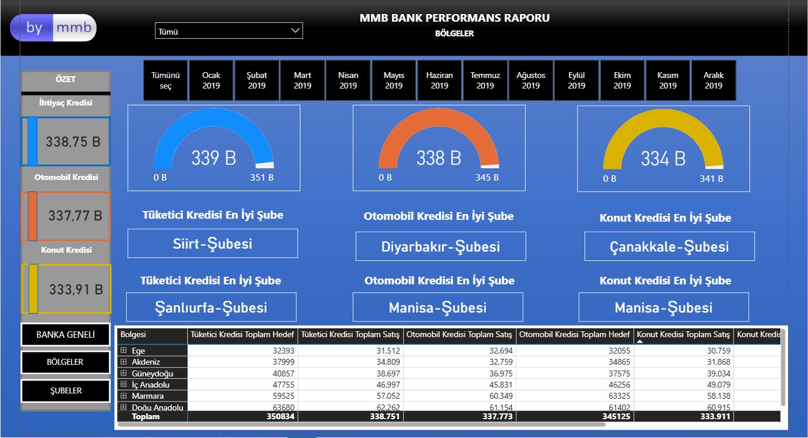
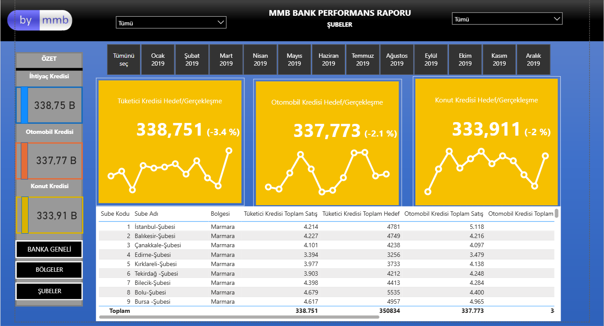

# Bank Loan Performance – Power BI Dashboard

This repository contains a Power BI dashboard that tracks **bank loan performance** across loan types, regions and branches.  
It is designed as a portfolio project to show how **targets vs actuals** can be monitored in an interactive way.

---

## Dashboard Pages

### 1. Bank Overview

High-level view of the whole bank:

- Total sales and targets for **Consumer**, **Auto** and **Mortgage** loans  
- Cumulative monthly performance over the year  
- Best and worst performing regions  
- Map of all branches

---

### 2. Regions

Regional comparison:

- KPIs for each loan type by **region**  
- Gauges showing how close regions are to their targets  
- “Best branch” labels per loan type  
- Table summarising regional totals (sales vs targets)

---

### 3. Branches

Detailed branch analysis:

- Actual vs target for each loan type at **branch level**  
- Trend lines of monthly performance  
- Table listing every branch with sales, targets and variance

---

## Dataset & Main Columns

The model is built around one main fact table of monthly loan results and simple dimension tables.

**Fact table (loan results)** – typical columns:

- **Branch Code** – unique ID for each branch  
- **Branch Name** – display name of the branch  
- **Region** – geographical region (Marmara, Ege, Karadeniz, etc.)  
- **Month / Date** – period of the result (used for time filters and trends)  
- **Loan Type** – Consumer, Auto, Mortgage  
- **Sales** – actual loan volume or amount achieved  
- **Target** – planned loan volume / target for the same period

From these, standard DAX measures are created, such as:

- Total Sales by loan type / region / branch  
- Total Target by loan type / region / branch  
- **Variance** (Actual – Target) and **% Variance**  
- Cumulative sales over the year

All numbers are **sample/demo data** and do not represent any real bank.

---

## How to Use

1. Download the Power BI file (`.pbit` or `.pbix`) from this repository.  
2. Open it with **Power BI Desktop**.  
3. If you want to plug in your own data, update the data source in **Transform Data (Power Query)**, keeping the same basic column structure (Branch, Region, Date, Loan Type, Sales, Target).  
4. Refresh the report and explore performance by loan type, region and branch using the slicers at the top of each page.
